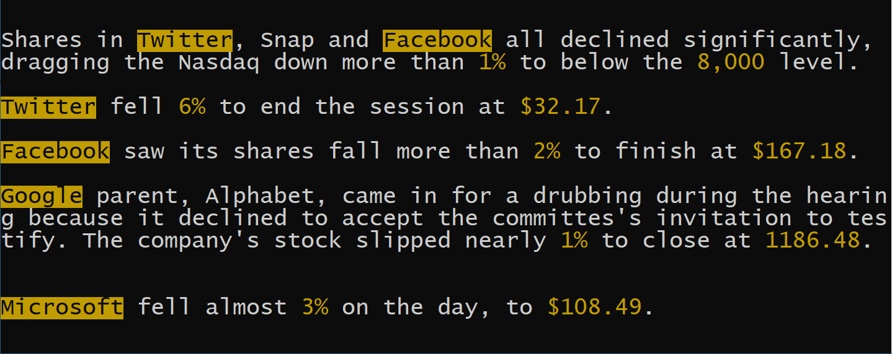

# Color Console

A lightweight header-only C++ library to bring colors to your Windows console with a very-easy-to-use API that frees you from the burden of setting and resetting with colors every time you make a call.

## Installation

Put [`color.hpp`](include/color.hpp) in the folder where you include headers.

## How to Use?

```c++
#include "include/color.hpp"
#include <iostream>

int main()
{
    std::cout << dye::aqua("Hello, World!") << std::endl;
    return 0;
}
```

You are seeing `Hello, World!` in aqua.

## More Examples

Consider a marker that takes in a `std::string` and marks the keywords and numbers with the given `color`.

```c++
auto mark(const string & str, string color)
{
    istringstream iss(str);
    auto marked = dye::vanilla("");
    for (string line; getline(iss, line); marked += "\n\n") {
        istringstream lineiss(line);
        for (string text; lineiss >> text; marked += " ") {
            string pre, word, post;
            // split a text into 3 parts: word in middle, and punctuations around it
            separate(text, pre, word, post);
            marked += pre;
            if (is_keyword(word))
                marked += dye::colorize(word, color).inverse();
            else if (is_number(word))
                marked += dye::colorize(word, color);
            else
                marked += word;
            marked += post;
        }
    }
    return marked;
}
```

Suppose we call with

```c++
auto tech_news_marked = mark(tech_news, "light_red");
cout << endl << tech_news_marked << endl;
```

Then we have


As another example which we mark both keywords and numbers

```c++
auto stock_news_marked = mark(stock_news, "yellow");
cout << endl << stock_news_marked << endl;
```

We are having



## Why Use it?


